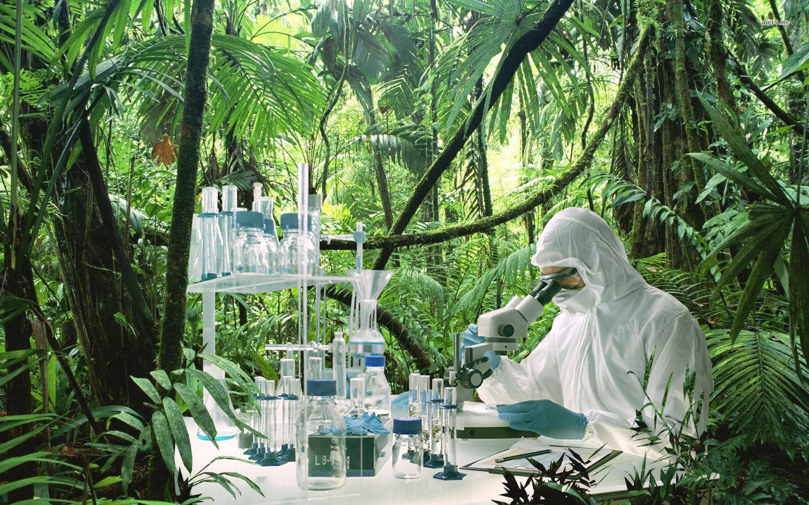

# :seedling: GenoRobotics 

## 🕵️Introduction 

Biodiversity preservation has become a major challenge of the XXIst century. The classical conservation and taxonomy approach no longer fit with the emergency of the situation. To fill the gap between new genomic conservation approaches and DNA sequencing technologies, GenoRobotics is developing a miniaturized tool to automatically process biological samples into the field and accelerate biodiversity identification.

Initiated in 2018, GenoRobotics started as a joint project between EPFL alumni and botanists to develop field tools for an expedition in the primary rainforests East of Madagascar. This highlighted the need for a solution to perform on-site DNA analysis in harsh environment. Therefore, GenoRobotics' goal is to popularize the access to DNA analysis for field applications by developing a fully portable, rugged and automated DNA analysis solution including DNA extraction and sequencing.

To identify the samples it studies, Genorobotics relies on the principle of DNA barcoding: four specific genes are amplified in plant samples and sequenced using the portable Oxford Nanopore MinIon sequencer. By comparison to large databases of genetic sequences such as [GenBank](https://www.ncbi.nlm.nih.gov/genbank/), the sample's species can be reliably inferred.

## :computer:Bioinformatics

The Bioinformatics division of Genorobotics handles the genomic data generated from sequencing, turning raw DNA reads generated by the MinIon into a species prediction. This requires three main steps:
- [Consensus Generation:](https://github.com/GenoRobotics-EPFL/Consensus) After a PCR (Polymerase Chain Reaction) is performed, the sample's gene of interest is amplified into thousands of near-identical fragments, all read by the sequencer. However, this process induces mutations, DNA breaks and inaccuracies, making the reconstitution of the original sequence from the reads challenging.
- [Species Identification:](https://github.com/GenoRobotics-EPFL/Identification) Once the consensus sequence is generated, it must be compared to large databases of genetic sequences to determine the species. The DNA alignment must thus be performed efficiently, and the results of the four alignments must be put together, resulting in one final species prediction
- [Database:](https://github.com/GenoRobotics-EPFL/Database) raw reads, species predictions, sample images, collaborating scientists...all of this data must be stored somewhere! This team looks to create a database that can be used to share information between members of Genorobotics, and potentially share knowledge with other international DNA databases.
Other steps of the pipeline are also optimized with bioinformatics, such as the design of universal primers that can bind to DNA independent of the species.

## :muscle:Main repos

🛠️ [utils:](https://github.com/GenoRobotics-EPFL/utils) general functions for dealing with raw fastq reads, calling bash commands, requesting genetic sequences online from GenBank, etc.

🧬 [Consensus:](https://github.com/GenoRobotics-EPFL/Consensus) as described above

🌿 [Identification:](https://github.com/GenoRobotics-EPFL/Identification) as described above

🌐 [Database:](https://github.com/GenoRobotics-EPFL/Database) as described above

🤖 [run-pipeline:](https://github.com/GenoRobotics-EPFL/run-pipeline) combine all functionalities into notebooks that can be run on raw sequencing data

👨‍🏫 [Training:](https://github.com/GenoRobotics-EPFL/Training) Resources for students to get started in the project with resources on the underlying biology, basic bioinformatics, collaborative coding with Github, etc.

